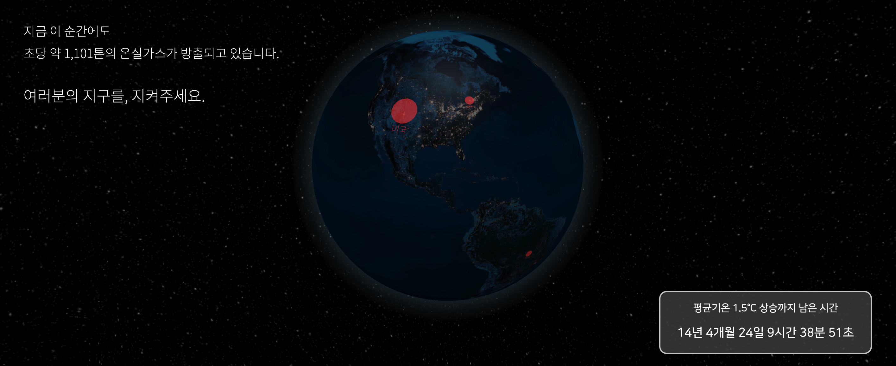

## 제 5회 정부혁신제안 끝장개발대회 출품작

## 🖥 프로젝트 설명 - 탄소시계 프로젝트

### 팀 지구대 (지구를 구하는 대학생들)

⏰ 우리에게 남은 시간이, 단 몇십 년 뿐이라고요?  
탄소시계 프로젝트는 세계의 탄소 배출현황과 지구 평균기온이 위험 수준으로 상승할 때까지 남은 시간을 보여줍니다.

리액트로 제작해 netlify로 배포하였으며, 별도의 백엔드 서버는 운영하지 않고 있습니다.
